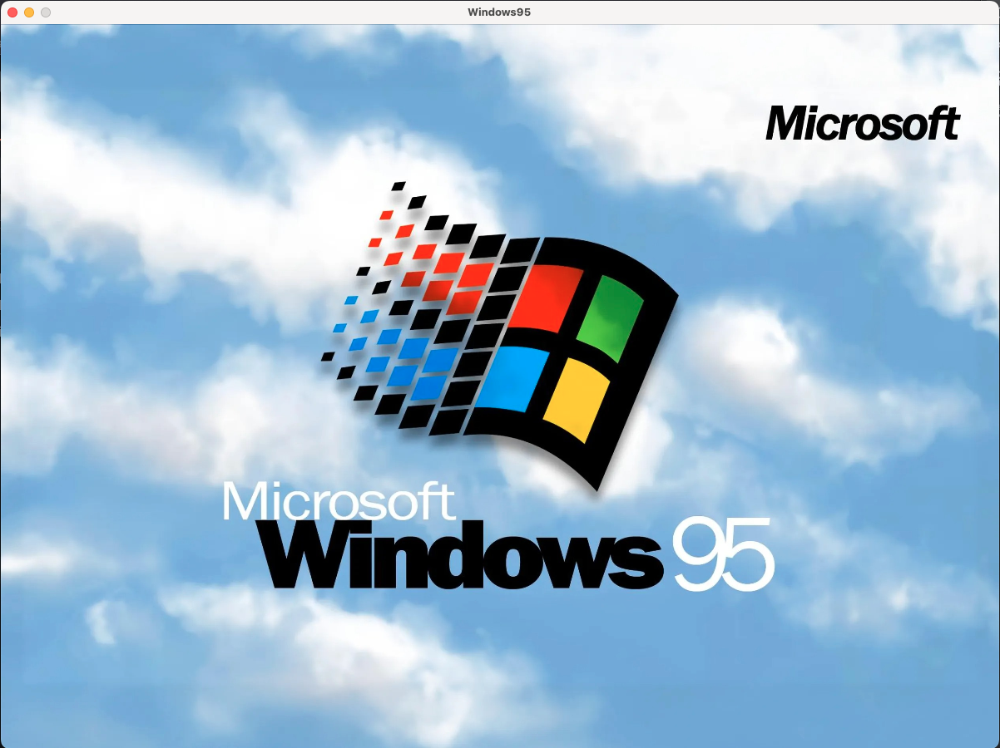
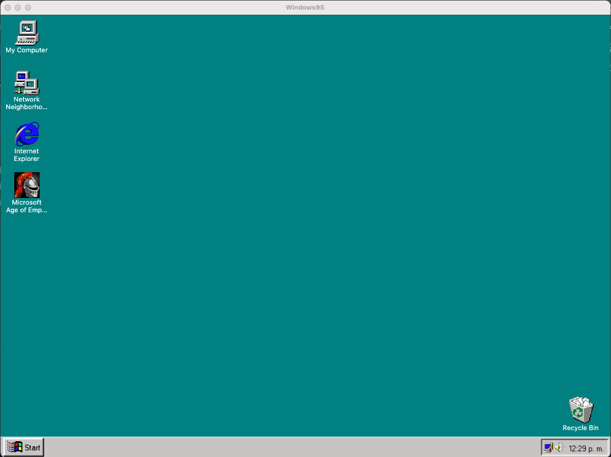
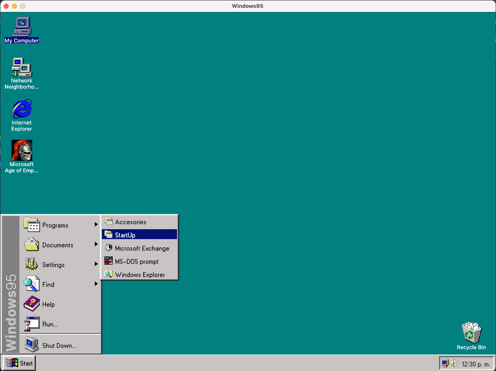
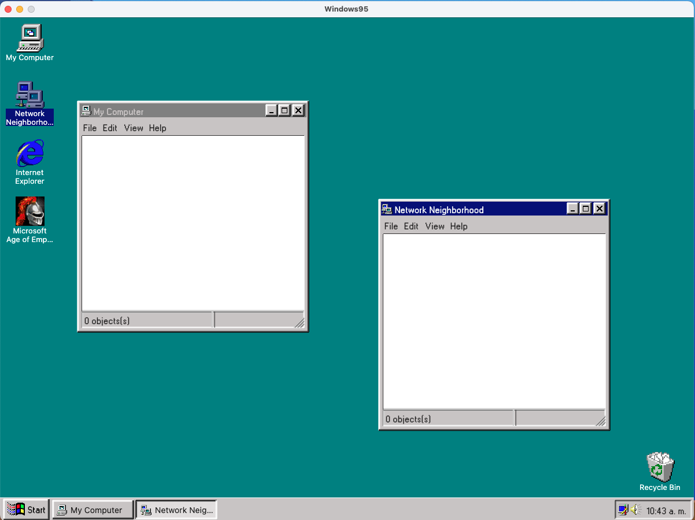
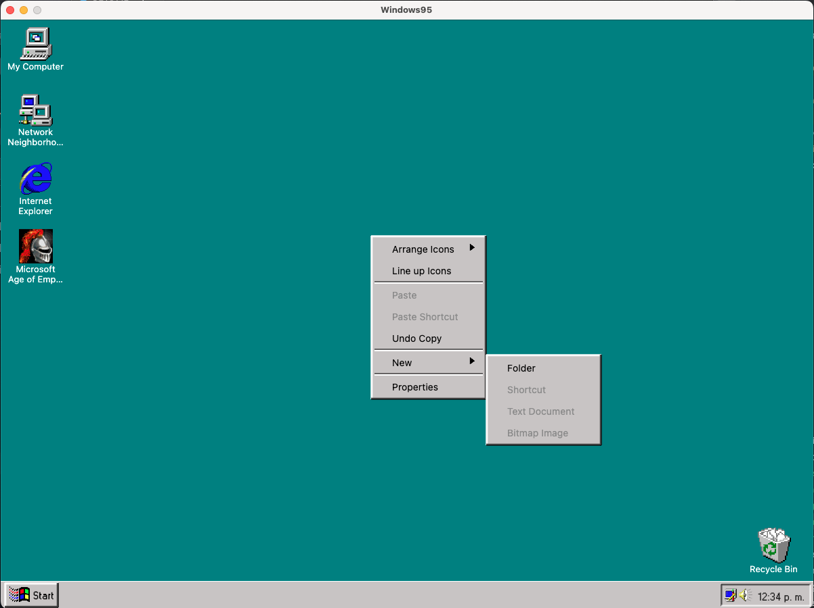
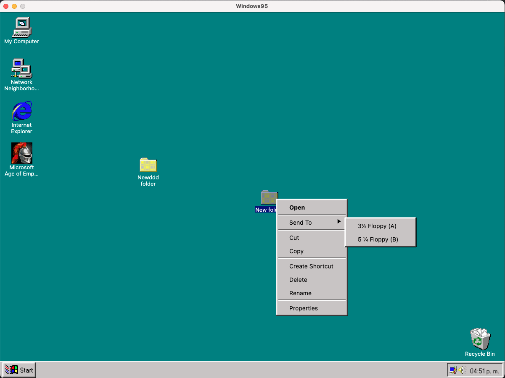
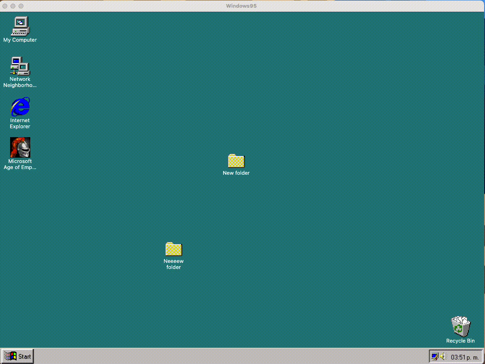

<p align="center">
  <a href="https://rlujancreations.es/" target="blank"></a>
</p>

> [!NOTE]  
> 🌐 This README is also available in [English](README.en.md).

---

# Kotlin Multiplatform - Windows 95

<p align="center">     </p>

In this project Kotlin Multiplatform (KMP) I have been recreated from the iconic Windows 95 and it has been created from the excellent
Course [ArisGuimera](https://github.com/ArisGuimera) [Replicando WINDOWS 95 con Kotlin Multiplatform Escritorio - Curso Avanzado de KMP desktop.](https://www.youtube.com/watch?v=QFPTUwFW9p8)

During the course I added and modified some details that I considered appropriate to make the project even more similar to the original Windows 95.

Once the course was completed I added the following Features and Functionalities

---
# Added Features
- Added dependency injection with **Koin**
- Data persistence with **room**
- Right menu over file
- Status bar in windows
- We can now create nested folders
- Delete files
- Other UI details
- Added blue screen of dead BSOD
---
### 📹 Video
<p align="center">
<a  href="https://youtu.be/1S7VOcXvBto"></a>
</p>


## 🛠 Installation

### Requirements

- **Kotlin 2.0.21+**
- **Compose Multiplatform 1.7.0+**
- **KMP-compatible IDE**: Fleet or Android Studio.
- Basic knowledge of Kotlin and KMP.

### Setup

1.  Clone this repository:

    ```bash
    git clone https://github.com/kmorfo/KMP_Windows95
    ```

2.  Open the project in Android Studio o Fleet.
3.  Sync the Gradle project to download dependencies.

## 🖼 Project Images.

|                            Loading screen                             |
|:---------------------------------------------------------------------:|
|  |

|                                Desktop                                |
|:---------------------------------------------------------------------:|
|  |

|                                Start menu                                |
|:------------------------------------------------------------------------:|
|  |

|                                Windows                                |
|:---------------------------------------------------------------------:|
|  |

|                               Right - Click                               |
|:-------------------------------------------------------------------------:|
|  |

|                            Right - Click over file                             |
|:------------------------------------------------------------------------------:|
|  |

|                    Classic blue screen of dead                     |
|:------------------------------------------------------------------:|
|  |
---

## 🌍 Supported Platforms

-   **Windows**
-   **MacOS**
-   **Linux**

---

##  Links
-   [Replicando WINDOWS 95 con Kotlin Multiplatform Escritorio - Curso Avanzado de KMP desktop.](https://www.youtube.com/watch?v=QFPTUwFW9p8)

-   [Windows 95 onLine](https://www.pcjs.org/software/pcx86/sys/windows/win95/4.00.950/)

-   [Windows 95 all icons](https://archive.org/details/windows-95-all-icons)

-   [Example Windows 95 Minesweeper](https://minesweepergame.com/download/windows-95-minesweeper.php)

-   [Convertir imagen a icon](https://onlineconvert.cloud/)
