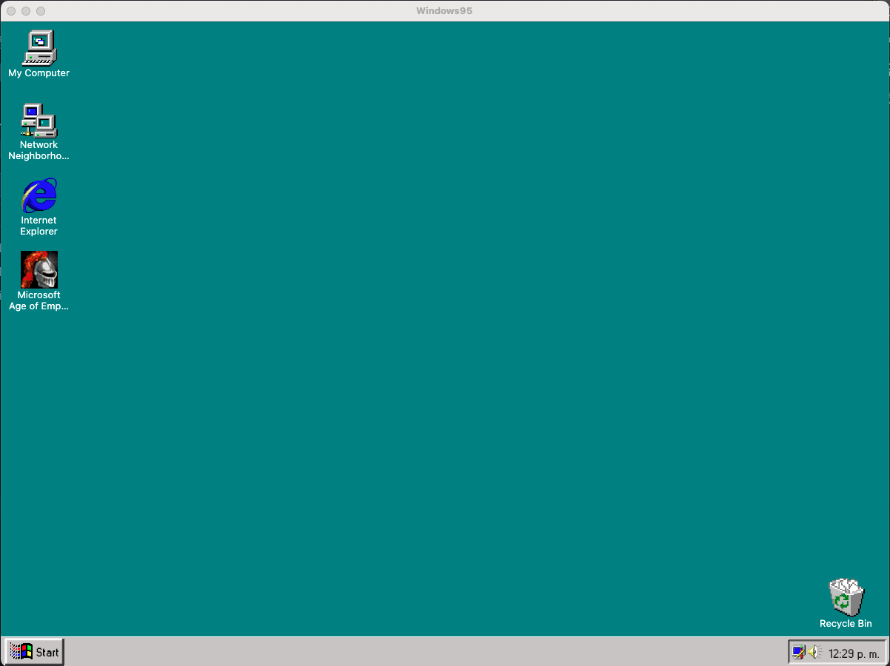
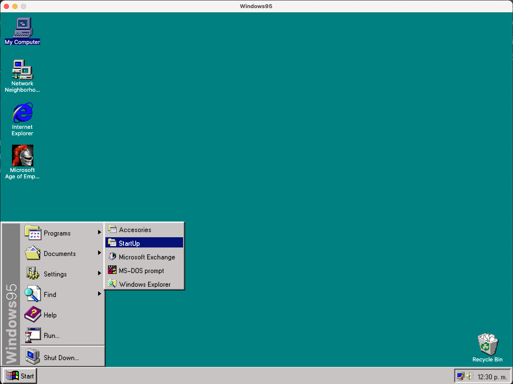
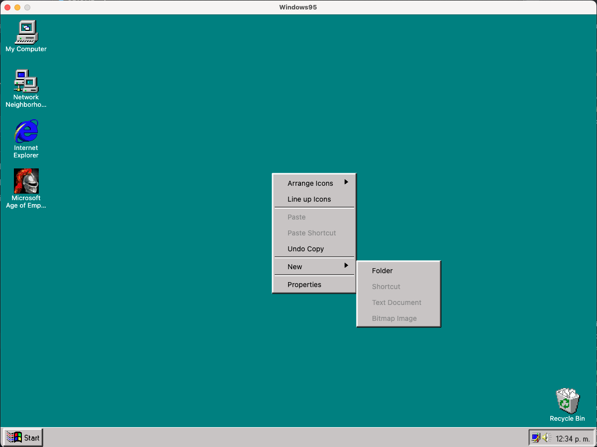

<p align="center">
  <a href="https://rlujancreations.es/" target="blank"></a>
</p>

---

# Kotlin Multiplatform - Windows 95

<p align="center">     </p>

Este proyecto Kotlin Multiplatform (KMP) del icónico Windows 95 se ha creado a partir del magnífico
Curso [ArisGuimera](https://github.com/ArisGuimera) [Replicando WINDOWS 95 con Kotlin Multiplatform Escritorio - Curso Avanzado de KMP desktop.](https://www.youtube.com/watch?v=QFPTUwFW9p8)

Durante el curso fui añadiendo y modificando algunos detalles que consideré oportunos para que el proyecto fuera aún más parecido al Windows 95 original.

Ya con el curso finalizado iré añadiendo más funcionalidades al proyecto.

---

## 🛠 Instalación

### Requisitos

-   **Kotlin 2.0.21+**
-   **Compose Multiplatform 1.7.0+**
-   **IDE compatible con KMP**: Fleet o Android Studio.

### Configuración

1.  Clona este repositorio:

    ```bash
    git clone https://github.com/kmorfo/KMP_Windows95
    ```

2.  Abre el proyecto en Android Studio o Fleet.
3.  Sincroniza el proyecto Gradle para descargar las dependencias.

## 🖼 Imágenes del proyecto.

|                          Pantalla de carga                           |
| :-------------------------------------------------------------------: |
|  |

|                          Pantalla principal                           |
| :-------------------------------------------------------------------: |
|  |

|                             Menú inferior                             |
| :-------------------------------------------------------------------: |
|  |

|                             Ventanas                              |
| :-------------------------------------------------------------------: |
|  |

|                             Click derecho                             |
| :-------------------------------------------------------------------: |
|  |

---

## 🌍 Plataformas Soportadas

-   **Windows**
-   **MacOS**
-   **Linux**

---

## Enlaces útiles
-   [Replicando WINDOWS 95 con Kotlin Multiplatform Escritorio - Curso Avanzado de KMP desktop.](https://www.youtube.com/watch?v=QFPTUwFW9p8)

-   [Windows 95 onLine](https://www.pcjs.org/software/pcx86/sys/windows/win95/4.00.950/)

-   [Windows 95 all icons](https://archive.org/details/windows-95-all-icons)

-   [Example Windows 95 Minesweeper](https://minesweepergame.com/download/windows-95-minesweeper.php)
